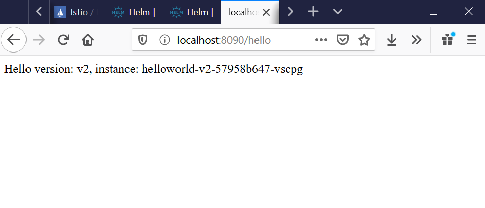

# istio-local-setup

Local minimal istio setup ready for apps to be installed and smoke tested. You can replace `helloworld` with any app you wish.

## Prerequisites

- Docker (tested with 8GB of RAM / 4 CPU's assigned)
- Kubernetes
  - You may use any Kubernetes setup you have e.g. MiniKube, Docker or even real hardware. Up to you. `kubectl config get-contexts` must point to your Kubernetes cluster. Here is a [tested configuration using Kubernetes using docker only and WSL on Windows](https://www.opvizor.com/combine-docker-kubernetes-and-windows-wsl)
- Helm

## Commands

```bash
# Download istio
curl -L https://istio.io/downloadIstio | sh -
cd istio-1.5.0

# Move istioctl to a location in your PATH
mv bin/istioctl /usr/local/bin

# Connect to local cluster in cat ~/.kube/config
kubectl config use-context docker-desktop

# Create namsepaces
kubectl create namespace istio-system
kubectl create namespace istio-local-setup

# Install istio bootstrap
helm install istio-init install/kubernetes/helm/istio-init --namespace istio-system

# Check it's loaded, should say 25
kubectl get crds | grep 'istio.io' | wc -l

# Install minimal istio
helm install istio install/kubernetes/helm/istio \
    --namespace istio-system \
    --values install/kubernetes/helm/istio/values-istio-minimal.yaml \
    --set gateways.istio-ingressgateway.type=NodePort \
    --set gateways.enabled=true

# Check all services deployed
kubectl get svc -n istio-system

# Check that istio-ingressgateway and istio-pilot pods are running
kubectl get pods -n istio-system

# Check issues e.g. out of memory
#kubectl describe pods istio-pilot-86b95b7b74-tgrbv -n istio-system

# Enable automatic injection on the default namespace
#kubectl label namespace default istio-injection=enabled
#kubectl get namespace -L istio-injection

# Test the chart
helm install --namespace istio-local-setup istio-local-setup charts/istio-local-setup/ --debug --dry-run

# Install the chart and its routing
helm install --namespace istio-local-setup istio-local-setup charts/istio-local-setup/ --debug

# Access the istio gateway
kubectl port-forward -n istio-system svc/istio-ingressgateway 8080:80
```

After pods have finished starting up, visit

http://localhost:8080/hello

and you should see



```bash
# Uninstall charts/istio-local-setup
helm uninstall --namespace istio-local-setup istio-local-setup
```

helm install --name traefik --namespace default \
 --set dashboard.enabled=true,dashboard.auth.basic.admin='$apr1$n5r7oJvl\$NydaAb2oe.IudnNy4dCz3/' \
 stable/traefik
https://www.htaccesstools.com/htpasswd-generator/

# admin

# password
